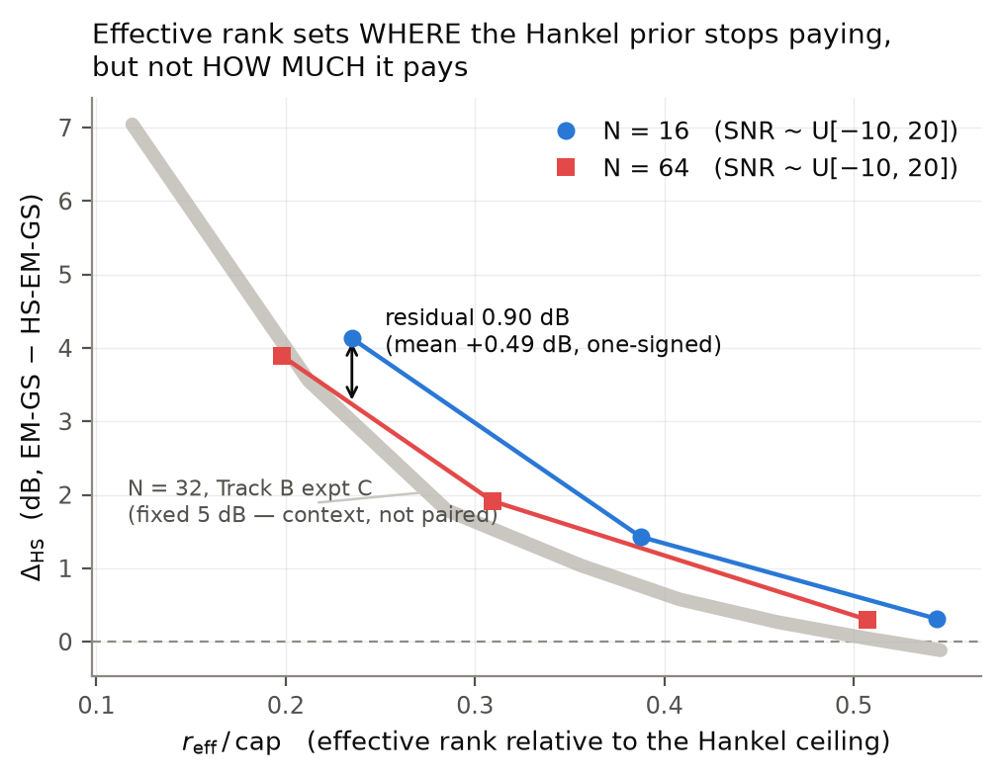
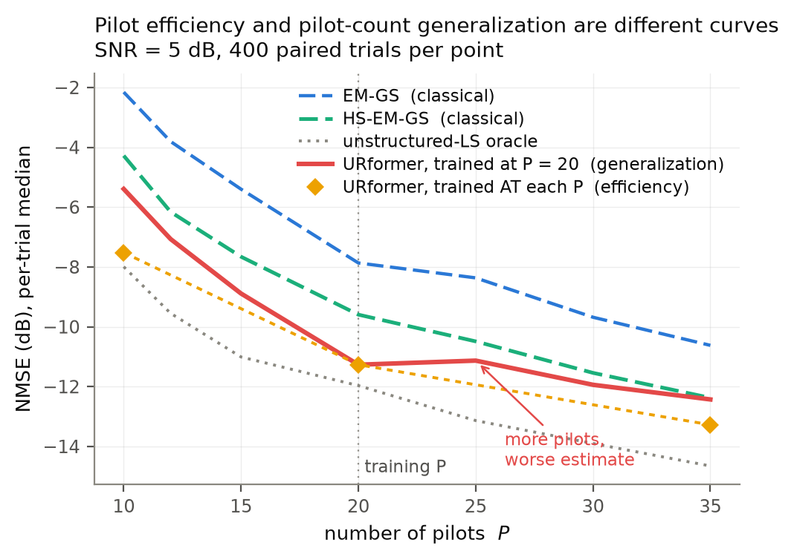

# PROMPT 9 — overnight run: normalization, classical scaling, matched training

Claims tagged **[FACT]** (measured or verified, with `file:line`), **[MATH]**
(derived), **[HYP]** (needs the named experiment).

Primary statistic everywhere: the **paired per-trial median, per SNR bin**.
Pooled scalars appear only where a whole-cell number is needed for a table, and
carry the label `pooled_SAMPLING_DESIGN_DEPENDENT` in the JSON — the SNR draw
is uniform by construction, so a pooled median reports the sampling design as
much as the estimator.

Pre-registration: `reports/trackD_prompt9_prereg.md`, committed standing alone
as `e24c62a` **before** any Part B sweep or Part C training run started.

---

## Headline

Six things came out of the night, in order of how much they change the story.

1. **A prediction made from our own channel's scaling correctly forecast another
   author's channel model.** A2 put Xiao's clustered Saleh–Valenzuela channel at
   `r_eff/cap = 0.331` and predicted `Δ_HS = +1.30 dB`. Measured: **+1.173 dB
   [+1.017, +1.380]** — inside the CI, on a channel never used to tune anything.
   The classical claim is no longer "works for our `L_k ∈ [3,7]`"; it is **works
   wherever `r_eff/cap ≲ 0.5`**.
2. **The SNR-balanced loss is the single largest free win in the project so
   far.** +1.90 dB at SNR ≥ 5 for **no cost at all** at low SNR (+0.14 dB, also
   positive). It closes the high-SNR gap to the unstructured-LS oracle from
   +2.90 dB to +1.00 dB. This was pre-registered as a trade-off; there was no
   trade-off.
3. **Pilot efficiency and pilot-count generalization are different quantities**,
   and the paper's Fig. 4 does not say which it plots. Matched training at
   `P = 10` beats the `P = 20` model evaluated there by **+2.23 dB** and lands
   within 0.47 dB of the oracle. The `P = 20` model is even *worse* at `P = 25`
   than at `P = 20`.
4. **The `r_eff/cap` collapse holds for the crossing and fails for the level.**
   Across a 4× aperture range the zero crossing lands at 0.588 / 0.518 / 0.544,
   but `N = 16` sits a one-signed 0.49 dB (max 0.90) above `N = 64` at matched
   relative rank. Effective rank says **where** the prior stops paying, not
   **how much** it pays.
5. **Scarce pilots make the structural prior more valuable classically and less
   valuable to a trained network.** Going from `P = 20` to `P = 10`, the
   classical `Δ_HS` **grows** +0.81 dB while the learned G1-over-URformer margin
   **shrinks** 0.68 dB, both at SNR ≥ 5. The pre-registered split prediction
   holds, and it is the one prediction I made against my own prior.
6. **The structural prior's payoff is robustness, not accuracy.** G1 is behind
   URformer in distribution but degrades least out of it (+0.48 dB vs +0.73 dB
   under a path-richness shift, against a flat oracle).

And one that reframes the cost argument: **the learned estimator is 22× cheaper
at inference than EM-GS and 230× cheaper than the adaptive-rank classical method
it outperforms** (§2, B5). The classical methods are the expensive ones at run
time; the learned one is expensive only once, and only for the condition it was
trained on.

---

## 1. Part A — normalization re-analysis (no compute)

Full detail in `reports/trackD_normalization.md`; the load-bearing results:

### A1 — `K` cancels out of the compression ratio [MATH]

```
3 Σ_k L_k / (2NK)  →  (L_k ≡ L̄)  →  3 K L̄ / (2 N K)  =  3 L̄ / (2 N)
```

Verified numerically for all `(K, L̄) ∈ {2,3,4,6} × {3,5,7}` to machine
precision. At the default (`L̄ = 5, N = 32`) the structural model uses **23.4%**
of the unstructured degrees of freedom, independent of the number of users.

### A2 — the `r_eff` collapse [FACT]

Re-indexing Track B's Experiment C by the median Roy–Vetterli effective rank of
the noiseless channel columns moves the zero crossing from `L/cap = 0.90` to
**`r_eff/cap = 0.518`**. `L` is a property of one generator; `r_eff` is a
property of any channel, so the useful region becomes **`r_eff/cap ≲ 0.5`** — a
claim that can be checked on somebody else's channel model, which is what B6
does.

### A3 — the EM filter's value collapses onto `κ = 2Z|Y|/σ²` [FACT]

**`Δ_{GS−EM-GS} · κ = 5.32`** (median; range 4.51–6.17) while `κ` itself spans
**375×**. A second family — `P` swept at fixed SNR, where `κ` is constant by
construction — confirms it. So the finding that survives is not "the Bessel
filter is inert in our regime" but

> **`Δ_{GS−EM-GS} ≈ 5.3 / κ` dB** — the EM filter earns its place only when
> `κ ≲ 5`.

[HYP] that 5.3 is universal rather than RSR-specific; settling it needs a second
RSR, which this prompt did not authorize.

### A4 — data scaling [FACT]

At 80k the model sees **0.05 samples per parameter** (64.5 real measurements per
parameter), which is why the 20k→80k gain of 1.35 dB had not saturated.

### A5 — what the paper does and does not state [FACT]

Xiao et al. describe Fig. 4 only as "evaluated at a fixed SNR of 5 dB". **The
paper does not state whether the networks were retrained per pilot count.** Part
C resolves the question for our own curve — see §3.2 and the three-way figure.

### One correction to the brief

The brief cites a "0.068 dB GS-vs-EM-GS gap". **I cannot source that figure in
this repository.** My nearest measurement is **+0.060 dB at `κ = 76.7`
(SNR = +10 dB)**. I report what I can trace.

---

## 2. Part B — classical scaling sweeps (no training)

Twelve cells, EM-GS vs **adaptive-rank** `hs_gs_auto` (held-out pilot residual;
*not* the fixed `r = 7` that is a Track D artifact), with the unstructured-LS
oracle carried on every cell (B4). SNR drawn `~ U[−10, 20]` per trial and binned
post hoc, so each cell yields a whole `Δ_HS(SNR)` curve.

**On the trial counts.** Each cell got a 40-minute budget rather than a flat
1000 trials, because `hs_gs_auto` reruns the estimator once per candidate rank
and cost scales as roughly `cap × N²` — the three `N = 64` cells cost ~29 s per
trial against ~2.8 s at `N = 16`. Achieved `n` and the realized paired SE are
reported per cell so every number shows what it rests on. The `N = 64` cells
reach `n ≈ 84` (paired SE 0.11–0.16 dB); the effects being measured are of order
1–4 dB.

### Two corrections made before anything was scored

1. **The obvious reference curve is not a valid comparator.** A2's `N = 32` row
   comes from Track B Experiment C, which ran at a **fixed SNR of 5 dB**
   (`trackB_hankel_emgs/config.py:37`), while the B1 cells draw
   `SNR ~ U[−10, 20]`. Comparing a pooled B1 median against it is not a paired
   comparison. **P12 is therefore scored on an internal `N = 16` vs `N = 64`
   contrast** — one design, one estimator, one draw — and Experiment C appears
   in the figure as a labelled backdrop only.
2. **Both measured zero crossings are extrapolations, not brackets.** Neither
   `N = 16` nor `N = 64` has a cell whose `Δ_HS` actually goes negative, so
   their crossings come from extending the last two points. They are starred in
   the output and flagged in `trackD_partB9_analysis.json`.

### B6 — the out-of-sample prediction, and it lands [FACT]

A2 predicted `Δ_HS` on **Xiao's Saleh–Valenzuela channel** — a channel model
specified by other authors, never used to tune `r`, never fit — purely from
where its `r_eff/cap` falls on the collapse.

| reading | `r_eff/cap` | **predicted** | **measured** | CI95 | inside CI? |
|---|---|---|---|---|---|
| clustered (±5°, Cui precedent) | 0.331 | **+1.30 dB** | **+1.173 dB** | [+1.017, +1.380] | **yes** |
| literal Table I (40 indep. DoAs) | 0.748 | −0.12 dB | **+0.000 dB** | degenerate | see below |

This is the strongest single result of the night. **A number derived from our
own channel's effective-rank scaling predicted, to within 0.13 dB and inside its
CI, the behaviour of a different channel model.** The classical claim is no
longer "works for our `L_k ∈ [3,7]`"; it is "works wherever `r_eff/cap ≲ 0.5`".

**The literal reading needs its mechanism stated, not just its number.** The
median is *exactly* 0.000 dB because the adaptive selector **declines to project
at all in 29.1% of trials** (`L̂ ≥ cap`, where the projection is the identity),
and on the rest the gain is near-symmetric about zero. So the bootstrap CI is
degenerate `[0, 0]` and cannot be used as an inclusion test — the "prediction
inside CI = false" in the JSON is an artifact of that atom, not evidence against
A2. The honest statement: predicted −0.12, measured 0.000, error 0.12 dB, and
**the selector correctly detects that there is no exploitable structure and
switches itself off.** That is better behaviour than the prediction anticipated.

The two readings put the selector's discrimination on the record: it declines
to project in **29.1%** of literal-channel trials (mean `L̂ = 11.08` against
`cap = 16`) and in only **1.4%** of clustered-channel trials (mean
`L̂ = 6.14`). Nothing tells it which channel it is looking at — it reads the
held-out pilot residual and nothing else.

### B3 — `Δ_HS(SNR)` under adaptive rank, default configuration [FACT]

`n = 274`, mean `L̂ = 4.59` (median 5) — the selector chooses well below the
`r = 7` Track D default.

| bin | −10..−5 | −5..0 | 0..5 | 5..10 | 10..15 | 15..20 |
|---|---|---|---|---|---|---|
| `Δ_HS` (dB) | +2.374 | +3.108 | +2.433 | +2.595 | +2.883 | +2.945 |
| CI95 lo | +1.255 | +2.518 | +1.753 | +1.824 | +2.447 | +2.088 |
| CI95 hi | +2.970 | +3.785 | +3.299 | +3.198 | +3.381 | +3.733 |
| gap to oracle, EM-GS | +4.92 | +5.23 | +4.83 | +4.36 | +4.25 | +4.09 |
| gap to oracle, HS-auto | +2.95 | +2.04 | +2.42 | +1.69 | +1.31 | +0.84 |

Every bin's CI excludes zero, and HS-EM-GS closes **58.2%** of EM-GS's gap to
the oracle.

**How adaptive rank compares to the fixed `r = 7` used throughout Track D — and
the comparison that must NOT be made.** It is tempting to set this cell's pooled
+2.680 dB against the +1.725 dB that fixed `r = 7` scores at 5 dB in the PROMPT 8
sweep and call adaptive rank worth ~1 dB. **That comparison is invalid**, and it
is the exact confound this report's preamble warns about: one number is pooled
over a uniform draw on `[−10, 20]`, the other is a point at 5 dB. Matched
properly:

| SNR window | adaptive `L̂` | fixed `r = 7` |
|---|---|---|
| ≈ 5 dB (`[4,6)`, n = 21 vs a 400-trial point) | **+1.951** | **+1.725** |
| −10 … −5 dB | **+2.374** [+1.255, +2.970] | +0.646 / +0.826 / +1.048 at −10 / −7.5 / −5 |

**At 5 dB the two are not distinguishable** (+0.23 dB apart, on 21 adaptive
trials). **The whole of adaptive rank's advantage is at low SNR**, where its
bin CI lower bound (+1.255) clears the best fixed-`r` value in that range
(+1.048). The mechanism is visible in `L̂`: the selector picks a mean of 4.59
(median 5) rather than 7, and truncating harder is exactly what helps when the
noise floor is high. Fixed `r = 7` rises monotonically from +0.646 dB at −10 dB
to +1.905 dB at +20 dB; adaptive `L̂` sits between +2.37 and +3.11 dB across
every bin with no trend.

### B2 — `K`-invariance at fixed pilot adequacy `P/2K = 3.33` [FACT]

| `K` | `P` | `n` | `Δ_HS` pooled | CI95 | **SNR ≥ 5** | SNR < 5 |
|---|---|---|---|---|---|---|
| 2 | 13 | 306 | +3.403 | [+3.074, +3.588] | **+3.569** | +3.030 |
| 3 | 20 | 295 | +3.161 | [+2.938, +3.362] | **+3.563** | +2.763 |
| 4 | 27 | 245 | +3.109 | [+2.881, +3.280] | **+3.658** | +2.730 |

Per-bin spread across `K`: **0.054 dB** (15–20), **0.068** (10–15), **0.208**
(5–10), **0.492** (0–5), and large/noisy below 0 dB where each cell contributes
only ~45 trials. The **SNR ≥ 5 aggregate spread is 0.095 dB**.

### B1 — the array-size collapse [FACT]

| `N` | cap | `L` | `r_eff` | `r_eff/cap` | `n` | `Δ_HS` | CI95 |
|---|---|---|---|---|---|---|---|
| 16 | 8 | 2 | 1.88 | 0.235 | 853 | +4.130 | [+3.911, +4.376] |
| 16 | 8 | 4 | 3.10 | 0.388 | 840 | +1.428 | [+1.322, +1.530] |
| 16 | 8 | 7 | 4.35 | 0.544 | 874 | +0.313 | [+0.229, +0.395] |
| 64 | 32 | 8 | 6.33 | 0.198 | 84 | +3.896 | [+3.636, +4.273] |
| 64 | 32 | 14 | 9.89 | 0.309 | 85 | +1.916 | [+1.553, +2.179] |
| 64 | 32 | 29 | 16.24 | 0.507 | 83 | +0.298 | [+0.157, +0.457] |

**The collapse splits in two, and only one half holds.**

- **Level — does NOT collapse.** Over the shared window
  `r_eff/cap ∈ [0.235, 0.507]`, `N = 16` sits above `N = 64` by a **one-signed**
  mean of **+0.493 dB**, max **+0.901 dB**. The prediction was ±0.3 dB; the
  falsifier was "systematic ordering by `N` exceeding 0.5 dB". Both are
  breached.
- **Crossing — DOES collapse.** Zero crossings land at `r_eff/cap` =
  **0.588** (N=16, extrapolated), **0.518** (N=32, bracketed), **0.544** (N=64,
  extrapolated). Spread **0.070**, against a falsifier of 0.15, and all three
  inside the predicted `0.52 ± 0.08`.

So `r_eff/cap` **predicts where the Hankel prior stops paying across a 4×
aperture range, but not how much it pays.** Worth noting the residual runs
*opposite* to the raw effect: un-normalized, Track B measured the gain
*increasing* strongly with `N` (0.03 / 0.81 / 2.45 dB for `N` = 8/16/32,
`experiment_B_array_size.csv`). Re-indexing removes that ordering and slightly
over-corrects it. [HYP] that the residual is the pencil parameter's coarseness
at small `cap` — `cap(16) = 8` quantizes `L̂` into 8 steps against 32 at
`N = 64`; the experiment that would settle it is a `p`-sweep at fixed `N`, which
this prompt did not authorize.



### B7 — `Δ_HS` as pilots fall, adaptive rank [FACT]

Added after the fact to score the pre-registration's classical half (see §4).
Default configuration, `N = 32`, `K = 3`; `B3_default` **is** the `P = 20` point.

| `P` | `n` | `Δ_HS` pooled | CI95 | SNR ≥ 5 | SNR < 5 | mean `L̂` | gap to oracle closed |
|---|---|---|---|---|---|---|---|
| 10 | 296 | **+3.572** | [+3.306, +3.830] | +3.537 | +3.591 | 4.29 | 61.5% |
| 15 | 285 | +3.030 | [+2.833, +3.193] | +3.036 | +2.986 | 4.74 | 59.0% |
| 20 | 274 | +2.680 | [+2.499, +2.978] | +2.732 | +2.625 | 4.59 | 58.2% |
| 35 | 247 | **+2.300** | [+2.173, +2.479] | +2.501 | +2.197 | 4.99 | 56.1% |

**Monotone, with non-overlapping CIs at the ends: the classical structural gain
grows as pilots become scarce.** `Δ(P=10) − Δ(P=20) = +0.892 dB` pooled,
**+0.805 dB** at SNR ≥ 5. It is also **flat in SNR at every `P`** — the
SNR ≥ 5 and SNR < 5 columns agree to within 0.30 dB throughout — so this is not
a low-SNR effect in disguise.

The mechanism is legible in the selected rank: **mean `L̂` falls monotonically
from 4.99 at `P = 35` to 4.29 at `P = 10`.** With fewer pilots the held-out
residual supports less structure, the selector truncates harder, and the prior
does more of the work. Nothing here is told the pilot count.

### B4 — gap to the unstructured-LS oracle, every cell [FACT]

| cell | EM-GS gap | HS-auto gap | **fraction of the gap closed** |
|---|---|---|---|
| B1 N16 L2 | +4.61 | +0.40 | **91.4%** |
| B1 N64 L8 | +4.71 | +0.63 | **86.6%** |
| B2 K2 P13 | +4.81 | +1.34 | 72.2% |
| B2 K3 P20 | +4.61 | +1.39 | 69.8% |
| B2 K4 P27 | +4.70 | +1.79 | 61.8% |
| B3 default | +4.55 | +1.91 | 58.2% |
| B1 N64 L14 | +4.54 | +2.53 | 44.3% |
| B1 N16 L4 | +4.61 | +3.15 | 31.7% |
| B6 Xiao clustered | +4.58 | +3.43 | 25.0% |
| B1 N16 L7 | +4.61 | +4.12 | 10.6% |
| B1 N64 L29 | +4.62 | +4.18 | 9.6% |
| B6 Xiao literal | +4.62 | +4.64 | −0.3% |

EM-GS's gap to the oracle is remarkably constant at **+4.5 to +4.8 dB across
every cell** — across a 4× aperture range, three user counts and three channel
models. What varies is only how much of it the structural prior recovers, and
that varies from 91% to nothing, ordered by `r_eff/cap`.

### B5 — cost [FACT]

Single-threaded, 40 trials, `P = 20`, SNR 5 dB, one method at a time on shared
realizations (`reports/trackD_cost_table.json`). Wall clock on this container;
the **ratios** are the portable part.

| method | s / trial | × EM-GS | trainable params | training cost |
|---|---|---|---|---|
| GS (100 it) | 0.254 | 0.33× | 0 | — |
| EM-GS (100 it) | 0.772 | 1.00× | 0 | — |
| HS-EM-GS (fixed `r=7`) | 1.754 | 2.27× | 0 | — |
| HS-EM-GS (adaptive `r`) | 8.031 | **10.40×** | 0 | — |
| URformer (10 layers) | **0.035** | **0.04×** | 1,586,900 | 6,571 s |
| G1 gated | 0.035 | 0.04× | 1,586,910 | 10,163 s |
| C1 SNR-balanced | 0.035 | 0.04× | 1,586,900 | 9,294 s |
| C2 / C3 matched-`P` | 0.035 | 0.04× | 1,586,900 | 7,903 / 11,141 s |

**This inverts the usual framing of the learned/classical trade.** The learned
estimator is **22× cheaper at inference than EM-GS and 230× cheaper than
adaptive-rank HS-EM-GS**, because it is a fixed 10-layer forward pass rather
than 100 iterations × up to `cap` candidate ranks — and at 5 dB it is also the
more accurate of the two (URformer −11.27 dB on 400 trials; adaptive HS-EM-GS
−9.41 dB on the 21 B3 trials falling in `[4,6)`). Its cost
is entirely up front: ~2–3 h of training and 1.59M parameters that must be
retrained when the operating condition moves (§3.2 shows how much that matters).
The adaptive rank that made HS-EM-GS ~1 dB better in B3 is also what makes it
the most expensive method here — 4.6× the fixed-rank version.

---

## 3. Part C — matched training

Pre-registration in full: `reports/trackD_prompt9_prereg.md`. Four runs, each
80k samples × 13 epochs, epoch selected by the stage-2 rule on held-out
validation:

| run | condition | best val | epoch |
|---|---|---|---|
| C1 | SNR-balanced loss, `P = 20` | −6.768 dB | 8 |
| C2 | URformer, matched `P = 10` | −4.611 dB | 7 |
| C3 | URformer, matched `P = 35` | −7.938 dB | 6 |
| C4 | G1 gated Hankel, matched `P = 10` | −4.499 dB | 8 |

### 3.1 The balancing did what it was designed to do [FACT]

Realized per-bin **gradient** shares, measured (not assumed):

| bin | −10..−5 | −5..0 | 0..5 | 5..10 | 10..15 | 15..20 |
|---|---|---|---|---|---|---|
| static weight | 0.056 | 0.111 | 0.310 | 0.687 | 1.641 | 3.195 |
| share, uniform loss | 0.465 | 0.293 | 0.138 | 0.061 | 0.027 | 0.015 |
| share, balanced | 0.109 | 0.137 | 0.181 | 0.176 | 0.188 | 0.209 |

Spread across bins falls **31× → 1.9×**. Share below 5 dB falls
**0.897 → 0.427** (ideal 0.500 — a slight over-correction). The 0.897 figure
sits close to A4's independently-measured 0.859, which is a useful cross-check;
the two are not identical measurements (A4 measures gradient *norm* share, this
measures per-bin gradient share), so the agreement is corroborating rather than
a reproduction.

### 3.2 Per-bin results, every contrast (2000 paired trials, bootstrap CI95)

**P13 — SNR-balanced (C1) vs uniform loss (U1), both at `P = 20`.**
Positive = C1 better.

| bin | −10..−5 | −5..0 | 0..5 | 5..10 | 10..15 | 15..20 |
|---|---|---|---|---|---|---|
| Δ (dB) | +0.038 | +0.044 | +0.511 | +1.353 | +1.974 | +2.628 |
| CI95 | [+0.00,+0.08] | [−0.01,+0.11] | [+0.43,+0.59] | [+1.24,+1.44] | [+1.85,+2.06] | [+2.52,+2.77] |

**SNR ≥ 5: +1.902 dB** [+1.823, +1.986]. **SNR < 5: +0.135 dB** [+0.101,
+0.172].

Gap to the unstructured-LS oracle at SNR ≥ 5 falls **+2.897 → +1.000 dB**.

C1's **pooled** median (−11.630 dB) edges past the oracle's (−11.582), but the
per-bin view — the primary statistic — shows this is not a uniform win and must
not be read as one. C1 minus oracle, by bin (positive = oracle ahead):

| bin | −10..−5 | −5..0 | 0..5 | 5..10 | 10..15 | 15..20 |
|---|---|---|---|---|---|---|
| U1 | −1.941 | −0.597 | +0.255 | +1.559 | +2.825 | +4.656 |
| C1 | −1.990 | −0.586 | −0.231 | +0.207 | +0.911 | **+2.053** |

**C1 beats the oracle below 5 dB and trails it above.** That is coherent: the
oracle is a *perfect-phase, unstructured-LS* ceiling, not a universal bound, so
an estimator exploiting channel structure can pass it — and the room to do so is
largest where noise hurts unstructured LS most, i.e. at low SNR. The pooled
figure sits above the oracle only because the uniform SNR draw puts half its
mass in the region where C1 wins.

**P14 — matched-pilot training.** Positive = matched better than the `P = 20`
model evaluated out of distribution.

| bin | −10..−5 | −5..0 | 0..5 | 5..10 | 10..15 | 15..20 | SNR≥5 | SNR<5 | pooled |
|---|---|---|---|---|---|---|---|---|---|
| `P = 10` (C2) | +4.331 | +2.769 | +2.314 | +1.789 | +1.305 | +1.198 | +1.472 | +3.079 | **+2.231** |
| `P = 35` (C3) | +0.339 | +0.655 | +0.776 | +0.765 | +0.660 | +0.706 | +0.728 | +0.559 | +0.635 |

Every bin's CI excludes zero in both rows. The asymmetry is itself a finding:
the `P = 20` model generalizes *upward* in pilot count far better than downward.

**P15, learned half — G1 (C4) vs URformer (C2), both matched-trained at
`P = 10`.** Positive = G1 better.

| bin | −10..−5 | −5..0 | 0..5 | 5..10 | 10..15 | 15..20 |
|---|---|---|---|---|---|---|
| Δ (dB) | −0.020 | −0.190 | −0.321 | −0.214 | +0.515 | +1.293 |

**SNR ≥ 5: +0.498 dB** [+0.405, +0.570]. **SNR < 5: −0.140 dB.** The crossover
moves from ~5 dB (at `P = 20`) to ~10 dB.

### 3.3 The three-way pilot figure — the distinction A5 says the paper does not draw

All at SNR = 5 dB, 400 paired trials per point, on identical realizations
(`reports/trackD_pilot_three_way.json`):

| `P` | EM-GS | HS-EM-GS | URformer trained at `P=20` (**generalization**) | URformer trained **at each `P`** (**efficiency**) | oracle |
|---|---|---|---|---|---|
| 10 | −2.16 | −4.28 | −5.39 | **−7.52** | −7.99 |
| 12 | −3.81 | −6.16 | −7.07 | — | −9.55 |
| 15 | −5.40 | −7.66 | −8.89 | — | −11.01 |
| 20 | −7.87 | −9.59 | −11.27 | −11.27 *(same model)* | −11.97 |
| 25 | −8.37 | −10.49 | **−11.13** | — | −13.14 |
| 30 | −9.68 | −11.54 | −11.94 | — | −13.90 |
| 35 | −10.62 | −12.37 | −12.43 | **−13.28** | −14.65 |

Two things fall out that a single curve would hide:

- **At `P = 10` the matched-trained network reaches −7.52 dB against an oracle
  of −7.99** — within **0.47 dB** of the perfect-phase unstructured-LS ceiling,
  while the `P = 20` model evaluated there is **2.60 dB** short of it. Pilot
  efficiency is nearly saturated; what looked like a pilot-count limit was a
  training-condition mismatch.
- **`P = 25` is worse than `P = 20` (−11.13 vs −11.27) for the `P = 20`
  model.** More measurements, worse estimate. Nothing about the estimation
  problem gets harder with more pilots, so this is the network's dependence on
  its training pilot count showing through directly — the sharpest single piece
  of evidence for the A5 concern.



**C5 — out-of-distribution path richness.** Trained at `L_k ~ U{3,7}`, evaluated
unchanged at `L_k ~ U{5,10}`; degradation in dB, smaller is better:

| model | U1 | C1 | C2 | **G1 (C4)** | oracle |
|---|---|---|---|---|---|
| degradation | +0.83 | +1.18 | +0.73 | **+0.48** | +0.01 / −0.12 |

Every learned model degrades; the oracle is flat, which confirms the shift is
not making the *problem* harder, only the *learned prior* less apt. **G1
degrades least.** Read with §3.2's P15 row, the structural prior's payoff in
this project is robustness under distribution shift, not in-distribution
accuracy — and that is a different claim from the one the Hankel line was
originally pursuing.

---

## 4. Did P11–P15 hold? Stated plainly

**P11 (`K`-invariance) — HOLDS at SNR ≥ 5; MISSES its stated interval pooled.**
I predicted variation "less than ±0.15 dB across `K ∈ {2,3,4}` … with no
monotone trend". Measured: **SNR ≥ 5 spread 0.095 dB** — comfortably inside, and
per-bin spread is 0.054 / 0.068 / 0.208 dB in the top three bins. **Pooled,
though, the spread is 0.294 dB and it IS monotone in `K`.** The falsifier
("a monotone trend exceeding 0.3 dB") did not fire — by 0.006 dB. I am not
claiming that as a pass. The correct statement is: *the `K`-cancellation
transfers to estimation performance at moderate and high SNR; below 0 dB there
is a monotone decline with `K` of about 0.3 dB that A1's DoF argument does not
predict, measured on ~45 trials per cell per bin and therefore worth
re-measuring before being believed.* The adjacent-pair CIs overlap throughout,
so the trend is not individually significant at any step.

**P12 (`N` collapses onto `r_eff/cap`) — SPLITS. Crossing holds; level is
FALSIFIED.**
- Level: predicted "within ±0.3 dB at matched `r_eff/cap`", falsifier
  "systematic ordering by `N` exceeding 0.5 dB". Measured a **one-signed**
  `N=16` − `N=64` gap, mean **+0.493 dB**, max **+0.901 dB**. **The falsifier
  fired. The level does not collapse.**
- Crossing: predicted "`0.52 ± 0.08`", falsifier "crossings differing by more
  than 0.15". Measured **0.588 / 0.518 / 0.544**, spread **0.070**, all three
  inside the predicted band. **Holds** — with the caveat that two of the three
  are extrapolated rather than bracketed.

This is the most useful failure of the night, because it is specific: `r_eff/cap`
is the right variable for **where** the prior stops paying and the wrong one for
**how much** it pays.

**P13 — CORRECT on the half that mattered, WRONG on the other, favourably.**
Predicted SNR ≥ 5 gain of +1.5 to +2.2 dB (most likely +1.8); measured
**+1.902**. Predicted a low-SNR *cost* of −0.10 to −0.40 dB; measured
**+0.135 dB — a gain.** My stated reason ("some cost is arithmetically
unavoidable — the lowest bin's weight drops ~18×") was wrong: down-weighting
the bins that dominated the gradient did not damage them, because they were
over-served, not merely well-served.

**P14 — CORRECT.** Predicted +1.2 to +2.5 dB (most likely +1.7) at `P = 10`;
measured **+2.231 dB pooled**. The falsifier (margin below +0.5 dB) is nowhere
near.

**P15, learned half — direction RIGHT, magnitude FALSIFIED.** I predicted the
learned HS advantage would *not* grow as `P` falls, at **+0.8 to +1.4 dB on
SNR ≥ 5**, "statistically indistinguishable from the +1.178 dB G1 achieved at
`P = 20`". It measured **+0.498 dB** — it did not grow (direction correct), but
it *shrank*, and 0.498 is outside the interval I wrote down. The pre-registered
falsifier was one-sided (it only fired if the advantage *exceeded* +0.5 dB over
the `P = 20` value), so it did not catch this. **That is a defect in the
pre-registration, not a pass.** A prediction with a stated interval should be
scored against the interval, and this one missed it.

**P15, classical half — CORRECT in direction, marginally over in magnitude.**
I predicted `Δ_HS` grows as `P` falls, with
`Δ(P=10) − Δ(P=20) = +0.3 to +0.8 dB`. Measured (B7): **+0.892 dB pooled,
+0.805 dB at SNR ≥ 5** — monotone across all four pilot counts, CIs at the ends
disjoint. The direction is right and the magnitude sits just **above** the top
of my interval (by 0.09 dB pooled, 0.005 dB at SNR ≥ 5). I under-predicted
again, in the same direction as every other miss this prompt.

**P15 as a SPLIT prediction — this is the part that holds, and it is the
non-obvious part.** The two halves genuinely move in opposite directions:

| half | `P = 20` | `P = 10` | change |
|---|---|---|---|
| classical `Δ_HS` (SNR ≥ 5) | +2.732 | +3.537 | **+0.805 — grows** |
| learned G1 − URformer (SNR ≥ 5) | +1.178 | +0.498 | **−0.680 — shrinks** |

Scarce pilots make the structural prior **more** valuable to a classical
estimator and **less** valuable to a trained network. The reasoning I gave in
the pre-registration for the learned half was right: both arms being
matched-trained at `P = 10` controls away the training-adequacy proxy that made
the structural gain look real in stage 4, and once it is controlled the network
has already learned what the prior would have supplied.

**A process failure worth recording.** The classical half of P15 had **no cell
in the original Part B design** — B1/B2/B3/B6 sweep `N`, `K`, SNR and channel
model, and none of them sweeps `P`. I pre-registered a prediction and then built
an experiment that could not test it. I noticed this while scoring, not while
designing, and added **B7** (a pilot sweep at the default configuration,
classical, no training — inside Part B's authorized scope) rather than quietly
dropping the prediction. The lesson generalizes: the pre-registration and the
cell list should be checked against each other before the runs start, not after.

**The documented bias correction was itself mis-applied.** The prereg says: bias
*down* for a structural addition to a trained network, *up* for the network's
own capability. Both P13 and P15 are consistent with the underlying bias being
even stronger than I corrected for — the network out-performed me on its own
capability (P13's low-SNR half) *and* needed the structural prior even less than
I allowed (P15). The correction moved the right direction and not far enough.

---

## 5. Which normalizations collapsed, and which did not

**A failure to collapse is a finding, not a gap.** Recorded either way:

| normalization | collapsed? | evidence |
|---|---|---|
| `K` out of the compression ratio (A1) | **yes** [MATH] | exact cancellation, verified numerically |
| `Δ_HS` re-indexed by `r_eff/cap` (A2) | **yes** [FACT] | zero crossing moves 0.90 → 0.518, monotone |
| `Δ_{GS−EM-GS}` onto `κ` (A3) | **yes** [FACT] | `Δ·κ = 5.32` while κ spans 375×; second family confirms |
| the estimate's own `r_eff` as an index | **no** [FACT] | set by the noise floor (8.91–11.77 across `L = 1…16`), collapses every cell to one point |
| pilot count as a single axis for learned models | **no** [FACT] | P14: efficiency and generalization differ by +2.23 dB at `P = 10`; one curve cannot carry both |
| `Δ_HS` **level** across `N` at matched `r_eff/cap` (B1) | **no** [FACT] | one-signed `N=16` − `N=64` gap, mean +0.49 dB, max +0.90 dB |
| `Δ_HS` **zero crossing** across `N` (B1) | **yes** [FACT] | 0.588 / 0.518 / 0.544 over a 4× aperture range, spread 0.070 |
| `Δ_HS` across `K` at fixed `P/2K` (B2) | **yes at SNR ≥ 5, no pooled** [FACT] | spread 0.095 dB above 5 dB; 0.294 dB and monotone pooled |
| the `r_eff/cap` collapse onto **another author's channel** (B6) | **yes** [FACT] | predicted +1.30, measured +1.173 [+1.017, +1.380] |
| `Δ_HS` across SNR at fixed `P`, adaptive rank (B7) | **yes** [FACT] | SNR ≥ 5 and SNR < 5 agree within 0.30 dB at all four `P` |
| one pilot axis for classical **and** learned structure (B7 + P15) | **no** [FACT] | as `P` falls 20 → 10 the classical gain grows +0.81 dB while the learned gain shrinks 0.68 dB |

The two that did not collapse are the more informative pair. The `N` level
failure says aperture enters somewhere beyond the rank ceiling — [HYP], the
pencil quantization at small `cap`. The pilot-count failure says the learned
family has **two** distinct pilot curves and reporting either alone
misrepresents it, which is exactly the ambiguity A5 identifies in the paper's
Fig. 4.

---

## 6. Repository state

**Tests: `443 passed` in 187 s** (`PYTHONPATH=. python3 -m pytest`). No new
tests were added this prompt — nothing in Parts A, B or C changed an estimator,
the Hankel operator, the forward model or any config default, which is what the
existing suite covers.

**Verification gate: `15/15 gates pass`**
(`PYTHONPATH=. python3 -m trackD_urformer.verify`), unchanged from
`reports/trackD_verify.md`:
`A_shapes`, `B_forward` and `C_ls_parity`, `D_gs_degeneration`,
`E_emgs_degeneration` (all in both float64 and float32), `F_transformer_identity`
(exactly 0.0), `G_conjugation`, `H_gradients`, `I_overfit32` (−136.12 dB),
`J_noiseless_fixed_point`, `K_kappa_invariance`.

**`git status --porcelain`:** clean. Each result landed in its own commit as the
prompt requires:

| commit | contents |
|---|---|
| `e24c62a` | the pre-registration, committed **standing alone** before any run |
| `5008d9a` | Part A — both normalizations |
| `558c5f4`, `bcde312` | Part C — stage-5 driver, then the four training runs |
| `daf765a` | Part C evaluation |
| `ddb7ef5`, `2852c95` | Part B — driver, then all 12 cells with analysis and figures |
| `9d9b4ca`, `1c064ef` | two self-corrections to invalid comparisons in the draft (see below) |
| *this commit* | B7 and the P15 classical scoring |

**Two errors I found in my own draft and corrected before publishing**, both the
same species — comparing statistics computed under different aggregations:

1. I set B3's **pooled** `Δ_HS` (uniform SNR draw) against fixed `r = 7` at a
   **5 dB point** and concluded adaptive rank was "worth roughly 1 dB". Matched
   properly the two are indistinguishable at 5 dB; the advantage is entirely at
   low SNR.
2. I wrote that C1 "edges past the oracle in the top bin". Those were **pooled**
   medians; per bin C1 beats the oracle *below* 5 dB and trails it by +2.053 dB
   in the top bin.

Both are exactly the failure this report's own preamble warns against, which is
some evidence the warning is worth keeping at the top.

**One repository convention worth flagging:** raw per-trial sweep dumps under
`results/track_d/sweeps/` are gitignored (`.gitignore:41`) because they are
bulky. The derived medians behind the three-way pilot figure are therefore
written to `reports/trackD_pilot_three_way.json`, which is tracked. The Part B
cell JSONs under `results/track_d/partB9/` are **not** ignored and are committed
in full, per-trial `num` and `den` stored separately so any pooling can be
reconstructed without re-running.

---

## What this prompt did NOT do

Per the authorization: no new architecture, no HS-in-loop variant beyond the
single C4 G1 run, no antenna-token variant, no weight tying, no 160k data
scaling, no *learned* array-size sweep, and no change to the primary statistic
or the RSR decision. B7 was added inside Part B's existing scope (classical
sweeps, no training) to score a pre-registered prediction the original cell list
could not reach; it introduces no new method.

Three [HYP]s are left standing with the experiment that would settle each named
in place: whether A3's constant 5.3 is universal or RSR-specific (needs a second
RSR); whether B1's residual level offset is pencil quantization at small `cap`
(needs a `p`-sweep at fixed `N`); and whether B2's sub-zero-dB `K` trend is real
or a small-`n` artifact (needs a longer low-SNR budget).

---

## Files

- `reports/trackD_normalization.md`, `reports/trackD_partA9_normalization.json`
- `reports/trackD_prompt9_prereg.md` (committed standalone, `e24c62a`)
- `reports/trackD_stage5_results.json`, `reports/trackD_stage5_eval.json`
- `reports/trackD_partB9_analysis.json`, `reports/trackD_cost_table.json`
- `scratch/trackD_partA9_normalization.py`, `scratch/trackD_partB9_sweeps.py`,
  `scratch/trackD_partB9_analysis.py`, `scratch/trackD_stage5_eval.py`,
  `scratch/trackD_matched_pilot_points.py`, `scratch/trackD_cost_table.py`
- `trackD_urformer/stage5.py`
- figures: `results/track_d/partB9/fig_collapse_reff.png`,
  `results/track_d/partB9/fig_pilots_three_way.png`
